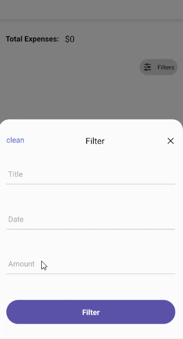
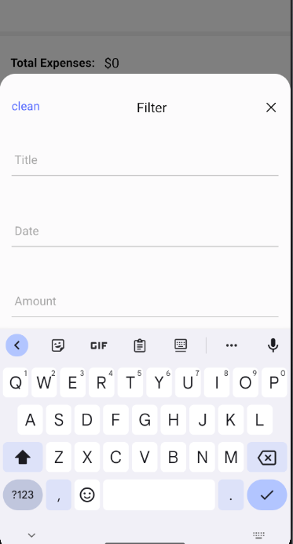

- A dynamic view that response to the keyboard and pushing the inner view with the height differences between the tapped position and the keyboard position.

- It comes with a built-in TypeScript typings and is compatible with all popular JavaScript frameworks. You can use it directly or leverage well-maintained wrapper packages that allow for a more native integration with your frameworks of choice.

# Example:

> **Dataset Properties**

| Name  | Type      | Default |
| ----- | --------- | ------- |
| props | ViewProps |
